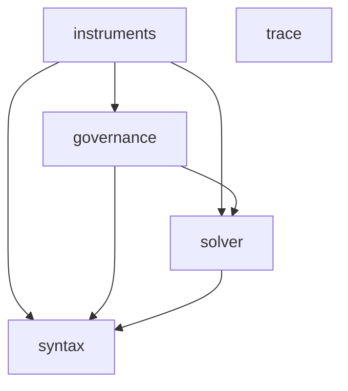
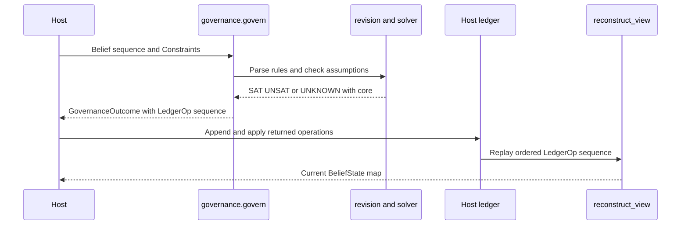

# Endoxa architecture

Endoxa is a Python library for a host agent that needs to check assertions, decide how a contradiction should be handled, retain an auditable history, and measure its own performance. It is not an agent framework and it does not provide a database implementation. A host owns writes and persistence; Endoxa returns decision data, defines portable record shapes, and exposes computation over snapshots.

## Dependency rule

`pyproject.toml` makes the following dependency DAG an enforced import-linter contract. A package may import only layers below it. `tests/test_package_boundary.py` also checks that every top-level package appears in that contract.

This is the allowed import direction, not an assertion that every permitted edge is used. In particular, [trace](../trace/proposition-store.md) is an independent persistence port, and [instruments](../instruments/calibration.md) are deliberately not imported by the systems they measure.

## Governed-belief lifecycle

The diagram shows the decision path documented in [decision and revision](../governance/decision-and-revision.md) and the record/read path documented in [ledger and view](../governance/ledger-and-view.md). `govern` never writes a host store. When conflict resolution is impossible from available policy evidence, it can return a `hold` operation rather than silently choose a belief.

## System boundaries

| Concern | Owner | Canonical surface | Boundary invariant |
|---|---|---|---|
| Atom identity | `syntax` | `parse_atom`, `ParsedAtom.key()` | Identity is predicate plus arity; argument terms remain opaque strings. |
| Logical consistency | `solver` | `Solver.check`, TPTP/API constructors | Results are `SAT`, `UNSAT`, or deliberate bounded-search `UNKNOWN`. |
| Conflict policy | `governance` | `govern`, revision functions | Returns immutable operations; host owns mutation. |
| Belief history and current projection | host plus governance schema | `LedgerOp`, `derive_ledger`, `reconstruct_view` | The record is append-only and derived state is replayed. |
| Cognitive proposition order | host trace adapter | `TraceStore` | Storage assigns durable total order (`seq`). |
| Calibration and coverage | `instruments` | calibration / coverage snapshots | Pure measurements consume supplied observations; subjects cannot import their own measures. |

## How to navigate a change

- Change contradiction policy, rules, functional predicates, or outcome operations: start at [decision and revision](../governance/decision-and-revision.md).
- Change audit import, evidence confidence fold, support, or current-state replay: use [ledger and view](../governance/ledger-and-view.md).
- Change expression language, parsing, satisfiability, or budgets: use [solver API and engine](../solver/api-and-engine.md).
- Change metrics: choose [calibration](../instruments/calibration.md) or [coverage](../instruments/coverage.md).
- Change host persistence integration: use [trace proposition store](../trace/proposition-store.md) or the governance ledger integration points.

Build, extra dependencies, CI, publishing, and wiki automation are documented in [development and operations](../operations/development.md).