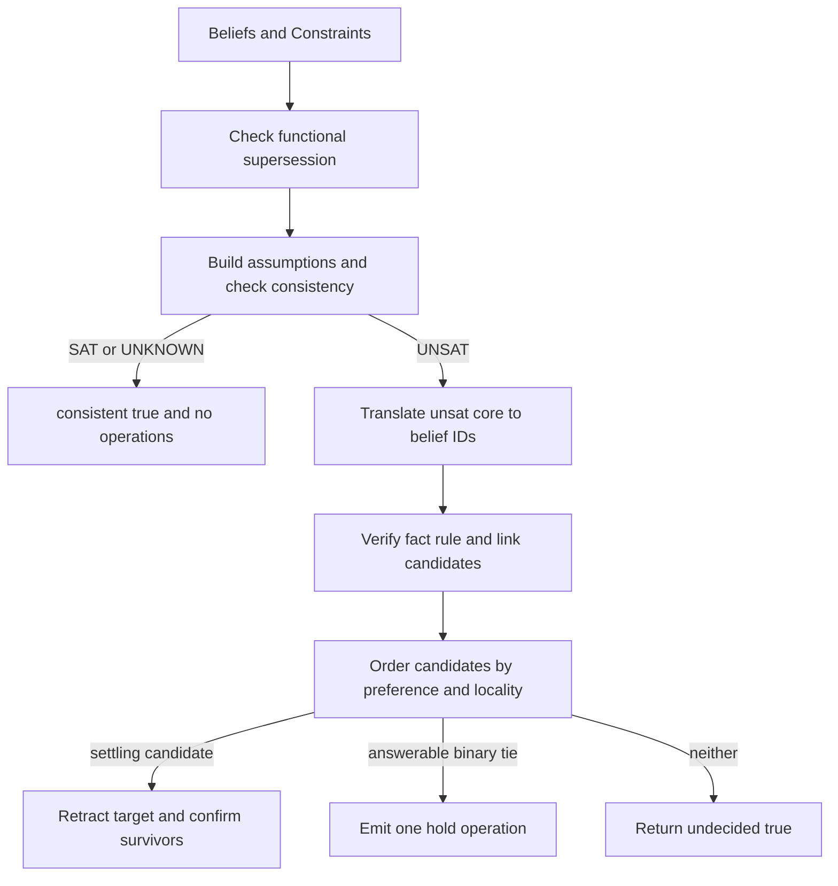

# Governance decision and revision

`endoxa.governance.govern` is the library's decision surface. Give it immutable input data—`Sequence[Belief]` and `Constraints`—and it returns `GovernanceOutcome`; it never mutates a belief store. The host appends and applies its returned [ledger operations](ledger-and-view.md).

## Public input and result

- `Belief(target, truth_value, confidence, context="")` identifies a fact string and its polarity/standing.
- `Rule(name, axiom, confidence, defeasible=True)` supplies a TPTP `fof` axiom. A rule may be considered for retraction only when defeasible.
- `Constraints(rules=(), hard_axioms=(), functional_predicates=frozenset())` combines named rules, non-retractable formula text, and predicate names whose final argument is functional.
- `govern(..., escalated: str | None = None, max_rounds: int | None = None)` optionally names the newly escalated atom for recency supersession and passes an E-matching round budget to consistency checks.
- `GovernanceOutcome(consistent, ops, hold, undecided)` contains the decision. `ops` are `LedgerOp` values; `hold` is a `ContradictionTie` when a binary conflict cannot be resolved; `undecided` means an UNSAT conflict was found but no supported operation/tie exists.

## Decision lifecycle



Functional supersession is evaluated first. For a configured functional predicate of arity at least two, claims sharing leading arguments but having a different final value form a replacement relation. The newer claim supersedes the older one; the generated operation preserves the older claim's confidence because changing state is not, by itself, calibration evidence.

Otherwise revision parses beliefs into solver assumptions and rules/hard axioms into hard constraints. Only `UNSAT` enters revision: `SAT` and budget-bounded `UNKNOWN` both return no operations. See [solver API and engine](../solver/api-and-engine.md) for why `UNKNOWN` is a real conservative result.

## Candidate policy and safeguards

`revision.build_assumptions` skips unparseable fact strings. `check_consistency` uses a fresh solver and maps its assumption unsat core back to node IDs. `entails` removes the queried target from premises and checks its negation, yielding `ENTAILED`, `NOT_ENTAILED`, or `UNKNOWN`.

Candidate ordering is deterministic: preference band then node ID, rather than solver core order.

1. Hypotheses (`context == "hypothesis"`) lose to equal-confidence assertions.
2. Lower confidence loses next.
3. Equal-confidence cross-kind choices prefer local change: fact, then link, then rule.
4. Confidence `1.0`, including a missing confidence default, is fail-safe inviolable.

A policy candidate is not enough. `select_verified_revision_target` rechecks whether changing it settles the relevant local cluster. This avoids retracting an explicit conclusion that remaining premises immediately re-derive. Rule and link culprit searches similarly use leave-one-out SAT rechecks: a candidate is culpable only if removing that one candidate settles the conflict.

An `UNKNOWN` solver answer supplies no core, no entailment, no culpability, and no reason to ask a tie question. An equal-band tie is eligible only for exactly two held, non-hypothesis beliefs whose affirmative and negative completions are both SAT. The emitted `hold` preserves both beliefs as unresolved; it is not a random retraction.

## Link constraints and extension surface

`PredicateConstraints` and `PredicateLink` synthesize ground clauses for functional exclusion, inter-predicate exclusion, and directed implication. Functional links require arity ≥ `FUNCTIONAL_MIN_ARITY`; inter-predicate exclusion is symmetric; implication is directed. `backward_implication_clauses` is used for positive entailment traversal.

When adding a constraint kind, change all of: its schema/registration in `revision.links`; clause synthesis; culprit and verified-selection handling in revision engine; `govern` composition; exports in `governance.revision`; and behavior-focused tests. Do not present a constraint as revisable unless its single-fault/verification semantics are defined.

## Focused tests and validation

- `tests/governance/test_resolution.py`: direct conflicts, rule retraction, confirms for survivors, holds, functional supersession.
- `tests/governance/revision/`: core translation, preference, culprit searches, tie eligibility, links, re-derivation avoidance, and matching-loop budgets.

```bash
uv run pytest tests/governance/test_resolution.py tests/governance/revision -q
```