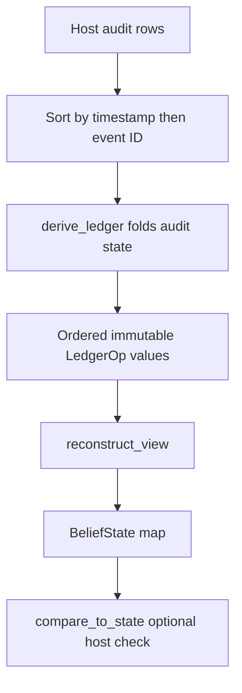

# Governance ledger, view, and schemas

Governance separates a durable operation history from its current projection. `LedgerOp` is an immutable schema a host appends; `reconstruct_view` folds the ordered sequence into `BeliefState` values. `derive_ledger` is a read-only adapter from host audit rows to the same schema. The record is not a cache: retraction adds a row and changes the replayed view without erasing the original assertion.

## Ledger operations

`LEDGER_OPS` is fixed to `assert`, `retract`, `supersede`, `confirm`, `refute`, `hold`, and `ground`. `LedgerOp` is frozen and slot-based, so corrections are later entries. Schema evolution is additive: new fields/operations may be introduced, but existing names and meanings must never be repurposed. `op` is the action; `target` identifies an atom expression or rule memory ID; `target_kind` is `atom`, `rule`, or reserved `link`; and `actor` is host role text. `truth_value` is the post-operation claim or `None` when truth does not change; `confidence` is an explicit credence or `None` when derived. `partner` is the other held target; `origin_event_id` and `at` attribute host origin/time; `reason` explains evidence; `session_id` records optional provenance; `supported_by` retains typed support endpoints; and `valid_at` is reserved claim-time semantics.

| Operation | Replay meaning |
|---|---|
| `assert` | Establish/update a target claim. |
| `retract` | Change a target out of its previous held state while preserving history. |
| `supersede` | Replace a claim with explicitly restated confidence. |
| `confirm` / `refute` | Add positive/negative evidence to the confidence fold. |
| `hold` | Mark both `target` and `partner` `UNRESOLVED`. |
| `ground` | Ground a target at confidence `1.0`; the only operation intended to confer that certainty. |

`SupportRef(kind, ref)` makes support endpoint type explicit: `kind` distinguishes derivations from rules even when identifier text happens to match. `supported_by` is active `tuple[SupportRef, ...]` data, so compatibility must preserve its typed—not bare-string—endpoint interpretation. `session_id` and `valid_at` are optional/reserved fields.

## Derivation and replay



`derive_ledger` accepts raw mapping rows with `id`, `timestamp`, `event_type`, and `payload` (the event ID may alternatively be in `payload.event_id`, and timestamp may be in `payload.timestamp`). It supports precisely two storage forms: a JSON-string `payload` with a `datetime` timestamp, or a dictionary payload with an epoch numeric timestamp. It internally sorts accepted rows by normalized timestamp (missing/unreadable timestamps sort as `0.0`) then event ID. First atom addition becomes `assert`; a truth flip with no stated confidence becomes `retract`, while one with stated confidence becomes `supersede`; grounding requests become `ground`; evidence maps to `confirm`/`refute`; a tie becomes one `hold`; axiom loads assert rules and confidence below the active threshold (default `0.5`) retracts them. `horizon` is the earliest readable timestamp, not a completeness claim; `rows_read` is input count and `rows_unreadable` counts non-object/unparseable payload rows. Unsupported event types produce no operations; malformed payloads do not raise; unknown evidence reasons and unknown support endpoint kinds are dropped rather than inferred. Support records influence folded support state but are not ledger operations.

Replay consumes operations in the supplied sequence order and returns a target-keyed map; a retracted target remains represented with its current claim. Replay uses `HELD` or `UNRESOLVED`. A hold affects both endpoints and releases automatically when their preference bands diverge; `released_by` records the triggering operation's origin event. `compare_to_state` separates truth breaks, confidence differences, evidence-attribution disagreement (`unattributed`), and missing state—truth is the central equivalence invariant.

Evidence is a Laplace-style fold: default prior strength is `2.0`, default ceiling `0.99`, and evidence cannot raise a fallible belief to `1.0`; already grounded claims remain untouched. On an unstated-confidence flip, prior evidence is re-attributed to the new polarity.

`support_verdict` is a pure support-footing fold: no supports is `UNSUPPORTED`; any `ALIVE` support is `IN`; all `DEAD` is `OUT`; otherwise a mix involving `ABSENT` is `INDETERMINATE`. Do not collapse absent/paged-out support into dead counter-evidence.

## Provenance and knowledge boundary

`EpistemicStatus` is exactly `known`, `uncertain`, or `unknown`. It is only vocabulary: thresholds, classification, restore policy, and when to ask remain host policy. `uncertain` and `unknown` are the non-known states consumed by [knowledge calibration](../instruments/calibration.md).

Provenance distinguishes immutable **origin** from later **retrieval**. `SOURCE_KINDS` are `user`, `tool`, `corpus`, `consolidation`, `derivation`, `seed`, and `unknown`; `RETRIEVAL_KINDS` are `read_through`, `spreading_activation`, and `conflict_check`. `PROVENANCE_KEYS`—`source`, `session_id`, `origin_event_id`—are fixed at birth and must be reattached on restore rather than overwritten by the retrieval mechanism. `source_kind_for_role` maps `user`/`conjecture`, `corpus`, `observation`, and `agent` roles to fallback origins; unknown roles map to `unknown`. Audit adapters and hosts own actual classification; these fixed names make rows and calibration observations interpretable.

## Validation

```bash
uv run pytest tests/governance/test_ledger_schema.py tests/governance/test_derive.py tests/governance/test_view.py tests/governance/test_support_verdict.py -q
```

The suites pin immutable schema fields, rare operations, ordering and unreadable-row accounting, bidirectional holds/release, evidence ceilings/re-attribution, and all support outcomes.