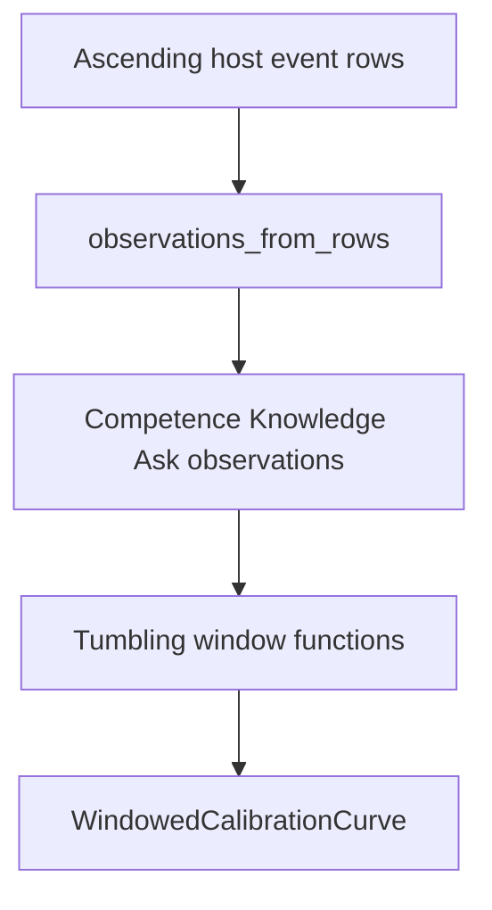

# Calibration instruments

`endoxa.instruments.calibration` measures whether an agent's confidence matched outcomes. It is pure accounting over host-supplied values and event rows: it has no persistence, concurrency, model, or governance decision dependency. The package is intentionally at the top of the import DAG so measured code cannot import and influence its instrument.

## Three facets

| Facet | Inputs | Result |
|---|---|---|
| Competence | predicted probability and actual success | Mean Brier score; lower is better. |
| Knowledge | per-target `EpistemicStatus` transition | Overconfidence and unknown-confirmation rates. |
| Ask policy | `affirmed`, `denied`, or `timed_out` outcome | Resolution and affirmation rates. |

Live accounting uses frozen values: `BrierAccumulator.observe`, `KnowledgeCalibrationStats.observe_transition`, and `AskOutcomeCounts.observe` return a new accumulator. `CalibrationSnapshot` composes existing results; it adds no fourth metric. Empty accumulators report `None`, not a misleading zero.

Knowledge status vocabulary comes from [governance schemas](../governance/ledger-and-view.md): `known`, `uncertain`, and `unknown`. A first sighting is not a transition. `known` to non-known contributes overconfidence; non-known to `known` contributes unknown confirmation. The host, not this package, selects status thresholds and ask policy.

Brier values are mean squared error. Callers must supply probabilities in `[0,1]`; this accumulator documents but does not enforce that range. Ask resolution includes timeouts in its denominator, while affirmation excludes them; timeout-only data has resolution `0.0` and an undefined affirmation rate.

## Replay and windowed curve



`observations_from_rows` recognizes only `PredictionOutcomeEvent`, `KnowledgeCalibrationSignalEvent`, and `QuestionResolvedEvent`. It preserves caller order and skips unrelated or malformed rows; callers must therefore provide rows in ascending time order. `CALIBRATION_EVENT_TYPES` documents that recognized set.

`windowed_competence`, `windowed_knowledge`, and `windowed_ask` divide streams into count-based tumbling windows, retaining a partial final window. `window_size < 1` raises `ValueError`. Knowledge membership resets at a window boundary by design, unlike cumulative live accounting, so each window can describe a local improvement period.

## Extension and validation

A new replayed metric needs a stable event name, strict extraction that skips malformed data, an observation type, cumulative semantics where applicable, a windowed function, package exports, and direct tests. Preserve the no-data `None` convention.

`tests/instruments/test_calibration_accumulators.py` includes Brier properties (one-pass mean, range, stream-order invariance), status transitions, and ask denominators. `test_calibration_windowed.py` checks partial windows, membership reset, replay filtering/order, and export completeness.

```bash
uv run pytest tests/instruments/test_calibration_accumulators.py tests/instruments/test_calibration_windowed.py -q
```