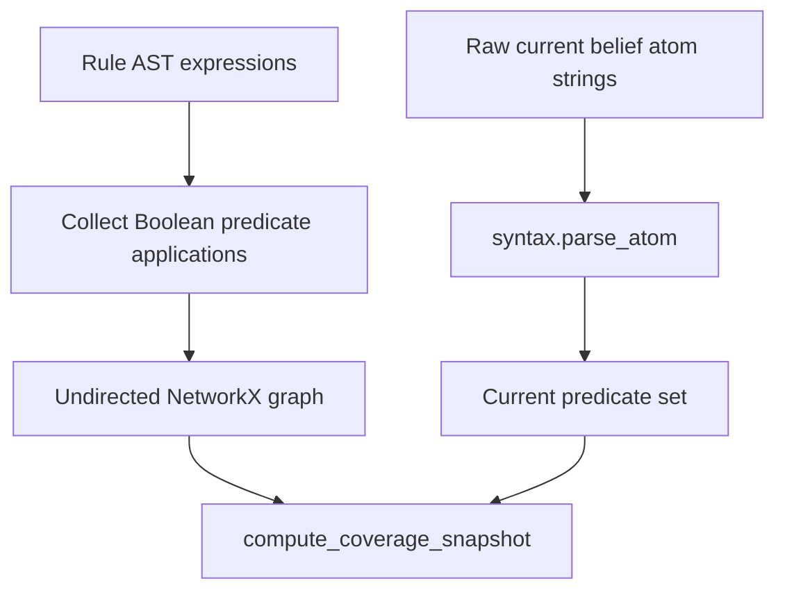

# Rule coverage instruments

`endoxa.instruments.coverage` measures whether rules connect predicates into a theory rather than leaving a glossary of isolated names. It requires the optional `coverage` extra (`networkx`) and exports `build_predicate_graph`, `rule_antecedent_links`, `compute_coverage_snapshot`, and `CoverageSnapshot`.

## Graph and snapshot semantics



`build_predicate_graph` walks expressions and creates an undirected clique among Boolean-sorted, non-connective predicates that co-occur in each rule. Logical connectives and equality are never nodes; term functions and constants do not qualify. A one-predicate rule still creates an isolated node. The graph is deliberately undirected for density measurement.

`rule_antecedent_links` supplies the separate directional view. It reconstructs implication antecedents from the solver's desugared `Or(Not(antecedent), consequent)` form by tracking negation polarity. Thus a compound antecedent can map a consequent to several source predicates, while the graph remains undirected.

`compute_coverage_snapshot` parses current belief atom strings with [atom syntax](../syntax/atoms.md), ignoring invalid strings. `linked_predicates` are currently believed predicates with graph degree above zero; `isolated_predicates` are current predicates with no rule link. `linked_ratio` is `None` if no parsable current predicates exist. `connected_components` describes the entire rule graph independently of current beliefs, and `rule_count` is the supplied expression count.

## Change boundary and validation

When changing solver AST representations, preserve connective/equality exclusion and the negation-polarity implication rule. When adding a coverage measure, distinguish rule-graph facts from current-belief facts so missing beliefs do not alter topology.

`tests/instruments/test_coverage.py` verifies implication edges, isolated fact axioms, disjoint components, compound antecedent direction, linked/isolated snapshots, empty input behavior, and invalid atom filtering.

```bash
uv run pytest tests/instruments/test_coverage.py -q
```