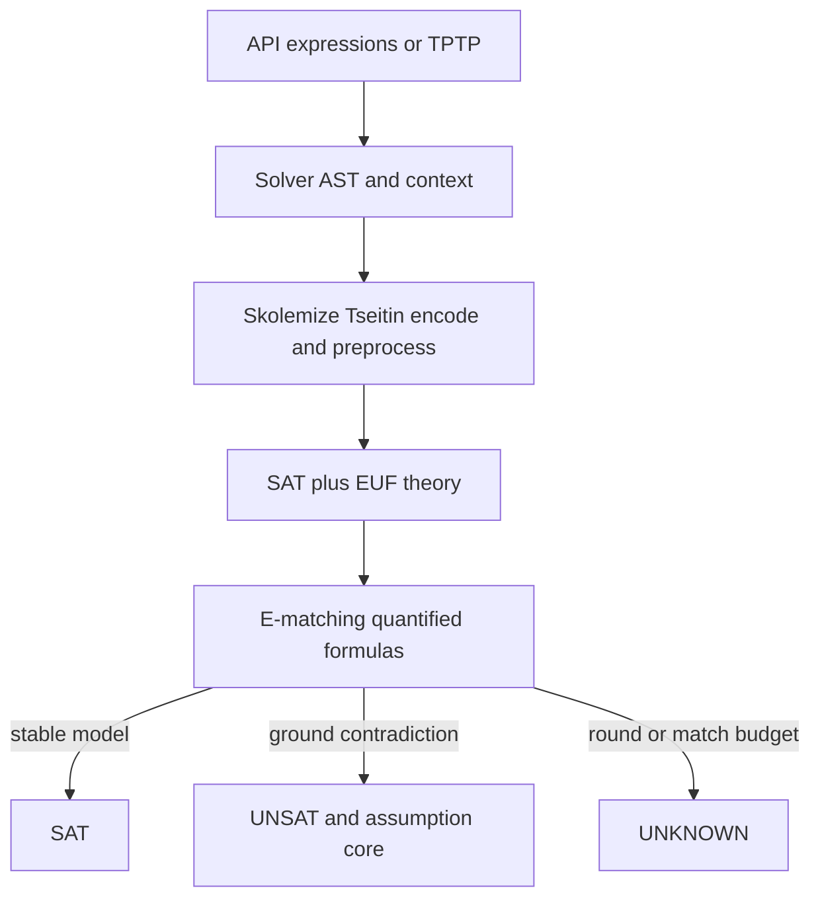

# Solver API and engine

`endoxa.solver` is a self-contained SMT layer. External callers import its facade rather than deep implementation modules. It provides expression constructors, a TPTP route, assumption-based checks and unsat cores; [governance](../governance/decision-and-revision.md) uses it to decide which conflicts are real.

## Public facade and result contract

The facade exports sorts/context (`BOOL_SORT`, `INT_SORT`, `Sort`, `USort`, `FuncDecl`, `global_ctx`); AST types (`Expr`, `App`, `Const`, `Var`, `Quantifier`); constructors (`Bool`, `Int`, `BoolVal`, `Function`, `BoundVar`, `MultiPattern`, `And`, `Or`, `Not`, `Implies`, `Eq`, `ForAll`, `Exists`); `Solver`; and TPTP `parse_fof` / `to_tptp`.

`Solver.add` installs hard formulas. `check(*assumptions, max_rounds=None, max_matches=None)` returns exactly `SAT`, `UNSAT`, or `UNKNOWN`. `push` creates an incremental scope and `pop(num_levels=1)` removes scopes, backtracking decisions; pop below level zero raises `ValueError`. `unsat_core()` returns the current stored core or an empty list. `model()` returns the encoded expression-to-integer model after a satisfiable engine run; before the engine has run it raises `RuntimeError`, and when no model is available (for example UNSAT) it raises `ValueError`. `statistics()` returns accumulated engine/SAT/EUF counters. `Eq` across incompatible sorts raises `TypeError`.



`UNKNOWN` is intentional anytime behavior. A match loop cut by `max_rounds` or `max_matches` must not claim SAT; it returns `UNKNOWN`. A contradiction already derived from ground clauses remains soundly `UNSAT` despite a later cut. `unsat_core()` reports participating assumptions, excluding unrelated assumptions.

## Input paths

### API and TPTP

`parse_fof` parses TPTP FOF formula text and `to_tptp` serializes expressions. Governance converts rule axioms through this path. Internal modules retain deep imports where needed to avoid parser/API cycles, but consumers should use the facade.

### DIMACS files

`endoxa.solver.parsers.dimacs.parse_dimacs(file_path)` is a separate, non-facade input helper. It opens a UTF-8 file and returns `(num_vars, clauses)`, where `num_vars` comes from `p cnf <vars> <clauses>` and each clause is `list[int]` of signed literals. It ignores blank lines and lines beginning `c`, `%`, or `0`; collects tokens across lines; treats `0` as a clause terminator; and retains a final unterminated clause. It does not appear in `endoxa.solver` or `endoxa.solver.parsers.__all__`, does not create the public AST, and is not direct input to the facade solving lifecycle. Callers own file errors, malformed numeric/header behavior, and any conversion from returned clauses into solver formulas.

## Change boundaries and verification

The engine coordinates skolemization, incremental Tseitin encoding, preprocessing, SAT, EUF, quantifier E-matching, tactics, AST, and parsers. Maintain result soundness and assumption-core mapping when changing an internal stage; an `UNKNOWN` must remain conservative.

`tests/solver/test_solver_unsat_core.py` checks propositional and EUF cores. `tests/differential/` generates formulas and compares Endoxa SAT/UNSAT results with Z3, including a seeded diversity check. Governance revision tests exercise bounded matching behavior at the consuming boundary.

```bash
uv run pytest tests/solver tests/differential tests/governance/revision/test_matching_loop_budget.py -q
```