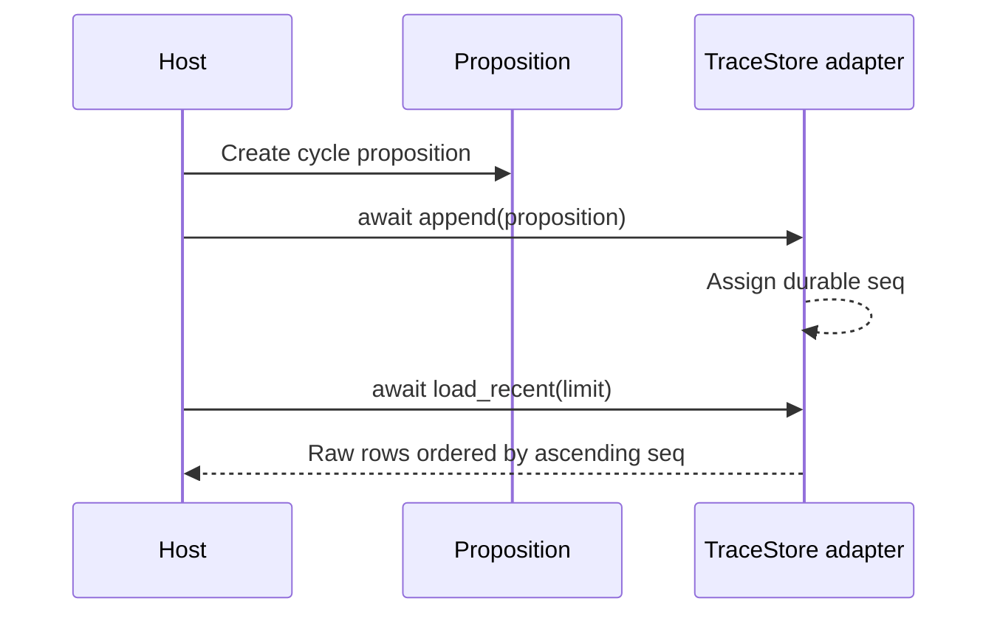

# Trace proposition store

`endoxa.trace` is an optional, independent package (`endoxa[trace]`) for recording the ordered series of an agent's propositions. It exports `Proposition` and `TraceStore`; it does not decide belief consistency or import governance. Its purpose is to standardize what a host must persist, while leaving storage technology and concurrency decisions to the host.

## Data and adapter contract

`Proposition` is a Pydantic model with these outer fields:

| Field | Meaning |
|---|---|
| `content_id` | Identifier for proposition content. |
| `kind` | Host-defined proposition category. |
| `salience` | Host-provided salience value. |
| `confidence` | Host-provided confidence. |
| `source` | Host-provided source label. |
| `session_id` | Session partition supplied by the host. |
| `cycle_index` | Locally monotonic cognitive-cycle index. |
| `timestamp` | Time supplied by the host. |
| `payload` | Arbitrary body, defaulting to `{}`. |

A host implements the asynchronous `TraceStore` protocol:

```python
async def append(self, proposition: Proposition) -> None: ...
async def load_recent(self, limit: int) -> list[dict[str, Any]]: ...
```

The key boundary is ownership of order. A proposition has no `seq` field before persistence. The store assigns `seq` at append time, and `load_recent` returns raw rows including that store-owned sequence number. `cycle_index` may reset when a process restarts and is therefore not the durable global order.



The selected *recent tail* may be limited, but rows inside that tail must be ascending by `seq`. Preserve `payload` verbatim and return raw dictionaries rather than silently rehydrating or filtering audit data.

## Extension recipe

To add a backend, implement both protocol methods, allocate a total-order sequence atomically with append, and make `load_recent(2)` select the final two records but return them oldest-to-newest. Do not infer ordering from timestamp or `cycle_index`.

`tests/trace/test_trace_store.py` provides an in-memory structural adapter test. It verifies payload defaults, insertion order `[1,2,3]`, and a five-row `load_recent(2)` result of sequence `[4,5]`.

```bash
uv run pytest tests/trace/test_trace_store.py -q
```